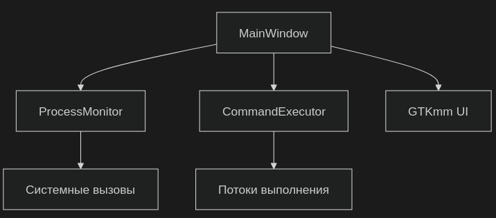
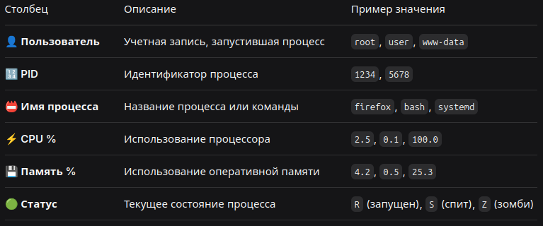

🖥️ System Monitor - Графический мониторинг системы для Linux

Мощный и элегантный инструмент для мониторинга системы и управления процессами

✨ Особенности
📊 Продвинутый мониторинг процессов

    Реальное время отслеживания загрузки CPU и памяти

    Подробная информация о каждом процессе

    Интеллектуальная сортировка по любым параметрам

    Визуальная фильтрация по имени процесса

⚡ Встроенный терминал

    Выполнение любых Linux команд

    Полная поддержка конвейеров |

    Цветная индикация результатов

    История выполнения команд

🎨 Современный интерфейс

    Темная тема с акцентными цветами

    Адаптивная компоновка элементов

    Русская локализация

    Интуитивная навигация

🛡️ Технологический стек

    C++17 - высокая производительность

    GTKmm 3.0 - нативные компоненты Linux

    Многопоточность - без блокировки интерфейса

    CMake - кроссплатформенная сборка

📦 Установка зависимостей
Ubuntu/Debian(bash)

sudo apt update && sudo apt install -y \
    build-essential \
    g++ \
    libgtkmm-3.0-dev \
    pkg-config \
    cmake \
    make

Fedora/RHEL(bash)

sudo dnf install -y \
    gcc-c++ \
    gtkmm3.0-devel \
    pkg-config \
    cmake \
    make

# Клонирование репозитория
git clone https://github.com/yourusername/system-monitor.git
cd system-monitor

# Сборка приложения 🛠️
mkdir -p build && cd build
cmake ..
make -j$(nproc)

# Установка (опционально)
sudo make install

▶️ Запуск приложения
bash

# Из папки сборки
./system-monitor

# Или если установлен системно
system-monitor

# Структура проекта 📋
text

# Мониторинг процессов 🎮
<table> <tr> <td width="60%">
bash

# Обновить список процессов
Нажмите кнопку "Обновить"

# Поиск процесса
Введите имя в поле "Поиск процессов..."

# Сортировка
Кликните по заголовку колонки

</td> <td width="40%">

Отображаемые параметры:

    👤 Пользователь

    🔢 PID процесса

    📛 Имя процесса

    ⚡ CPU %

    💾 Память %

    🟢 Статус

</td> </tr> </table>
Выполнение команд
bash

# Примеры команд для тестирования
ps aux | grep firefox | head -5          # Поиск процессов

df -h | grep -v tmpfs                    # Дисковое пространство
find ~/Documents -name "*.txt" | head -10 # Поиск файлов
top -bn1 | grep "Cpu(s)"                 # Загрузка CPU

# Столбцы информации 📊

    Отслеживание ресурсов IDE и компиляторов

    Мониторинг веб-серверов и контейнеров

    Отладка утечек памяти

🔧 Системным администраторам

    Контроль загрузки серверов

    Выявление проблемных процессов

    Управление системными службами

🎓 Студентам и исследователям

    Визуальное изучение работы ОС

    Эксперименты с процессами и ресурсами

    Образовательные демонстрации

👨‍💼 Обычным пользователям

    Понимание, что нагружает систему

    Завершение зависших программ

    Управление автозагрузкой

# Запуск с отладкой
G_MESSAGES_DEBUG=all ./system-monitor

# Просмотр системных сообщений
journalctl -f -t system-monitor

🤝 Участие в разработке

Мы приветствуем вклад сообщества! Вот как вы можете помочь:

    Сообщить об ошибке - создайте issue с подробным описанием

    Предложить улучшение - поделитесь идеями в Discussions

    Создать Pull Request - инструкция:
    bash

fork репозитория
git checkout -b feature/your-feature
внесите изменения
git commit -m "Add amazing feature"
git push origin feature/your-feature

    Улучшить документацию - помогите другим пользователям

Требования к коду

    Соблюдение стиля C++17

    Комментарии на английском языке

    Юнит-тесты для новой функциональности

    Документация публичных API

📄 Лицензия
text

MIT License

Copyright (c) 2024 System Monitor Contributors

Разрешается свободное использование, копирование, изменение, объединение,
публикация, распространение, сублицензирование и/или продажа копий
Программного обеспечения при соблюдении следующих условий:

1. Уведомление об авторских правах должно быть включено во все копии
   или существенные части Программного обеспечения.

2. ПРОГРАММНОЕ ОБЕСПЕЧЕНИЕ ПРЕДОСТАВЛЯЕТСЯ "КАК ЕСТЬ", БЕЗ КАКИХ-ЛИБО ГАРАНТИЙ.

Полный текст лицензии: LICENSE

🌟 Благодарности
Используемые технологии

    GTKmm - за прекрасный C++ интерфейс к GTK

    Glib - за кроссплатформенные утилиты

    CMake - за мощную систему сборки

Вдохновение

    GNOME System Monitor

    htop и подобные консольные утилиты

    Сообщество Linux за бесценный опыт

